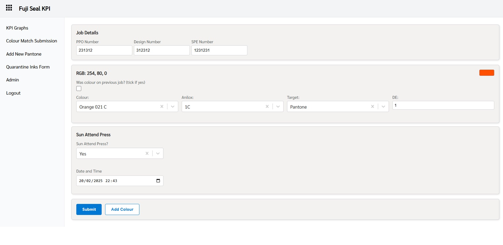
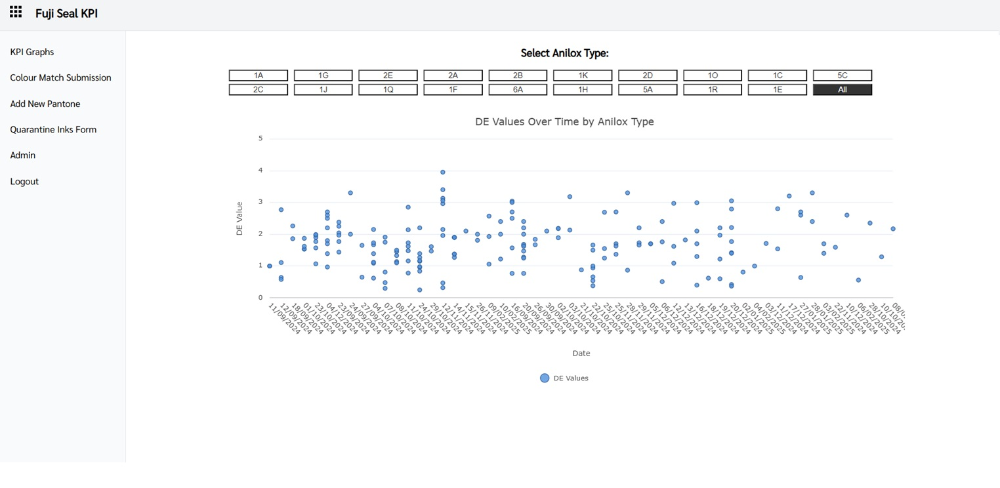
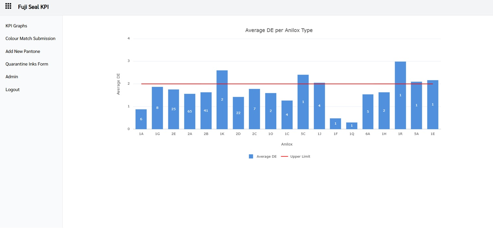

# KPI Dashboard & Graphs

A [Next.js](https://nextjs.org) project bootstrapped with [`create-next-app`](https://nextjs.org/docs/app/api-reference/cli/create-next-app).

## Getting Started

### Installation

```bash
# Clone the repository
git clone https://github.com/LewieM1995/kpi_app.git

# Navigate into the project folder
cd kpi_app

# Install dependencies
npm install

# Run the development server
npm run dev

# API Endpoints
NEXT_PUBLIC_API_URL=         # GET /api/specific_kpi_endpoint - Route to controllers for specific KPIs
NEXT_PUBLIC_API_URL_AUTH=    # POST /api/login - Authenticate the user
NEXT_PUBLIC_API_URL_QFORM=   # POST /api/quarantine-ink - Form submission for quarantine_form
NEXT_PUBLIC_API_URL_CHARTS=  # GET /api/charts - Retrieves chart data for visualization
NEXT_PUBLIC_API_URL_PANTONES= # GET /api/pantones - Fetches Pantone color information
NEXT_PUBLIC_API_URL_ADDPANTONE=    # POST /api/add-pantone - Add a new Pantone color
NEXT_PUBLIC_API_URL_CMFORM=        # POST /api/form_ - Form submission for cm_submission
NEXT_PUBLIC_API_URL_UPDATEPANTONES= # PUT /api/update-pantone - Updates Pantone color record
NEXT_PUBLIC_API_URL_DELETEPANTONE= # DELETE /api/delete-pantone - Deletes Pantone color record

# Project structure
/kpi_app
│── /public          # Static assets (images, etc.)
│── .env.local       # Environment variables
│── README.md        # Project documentation
│── /src/app
    ├── page.js      # Main page (localhost:3000/)
    ├── layout.js    # Root layout (displays children, provides auth)
    ├── /add_pantones
    ├── /admin
    ├── /auth_context
    ├── /client_layout
    ├── /cm_submission
    ├── /kp_graphs
    ├── /login
    └── /quarantine_form
        ├── page.js
        └── components.js

```

# Dependancies
    ag-charts-react: "^11.0.4",
    next: "15.1.6",
    react: "^19.0.0",
    react-dom: "^19.0.0",
    react-select: "^5.10.0"

# Screenshots




# Built With
+ React - Front end
+ MySQL - Database
+ AWS Hosting - RDS, Amplify and EC2
+ Nodejs - Backend / RESTful api


# Contact
GitHub: [@LewieM1995](https://github.com/LewieM1995)
LinkedIn: [Lewie Marks](https://www.linkedin.com/in/lewie-marks-b84504124/)